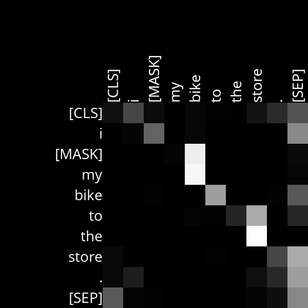

# Analysis

## Layer 6, Head 10

This attention head appears to pay attention to the word that immediately follows it, with the exception of determiners. It does not establish a relationship between a word if followed by a determiner. Instead, it establishes a relationship between the words preceeding and succeeding the determiner, and the determiner and the succeeding word.

For example, in sentence "Every [MASK], I walk my dog Bobbie", you can see that the attention head establishes a relationship between the word that succeeds it, except for the determiner "my". It does not establish a relationship between "walk" and "my", but instead establishes relationships between "walk" and "dog" and between "my" and "dog".

Similarly, for the sentence "I [MASK] my bike to the store", you can see the attention head establishes relationships between the word that immediately follows it, except for the determiners. The attention head does not establish a relationship between the mask and "my", and also does not establish a relationship between "to" and "the". Instead, it establishes relationships between MASK and "bike", and between "to"and "store".

## Layer 8, Head 5

This attention head pays attention to the word that immediately preceeds it, and does so very well. It scores best when analyzing noun phrases (or objects), as you can see towards the end in both sentences.

For the Sentence "Every [MASK], I walk my dog Bobbie", it establishes strong relationships between the section "my dog Bobbie", and every preceding word in that noun phrase ("my" and "walk", "dog" and "my", etc.).

Similarly, for the sentence "I [MASK] my bike to the store", you can see that it establishes strong relationships between words and preceeding words for the noun phrase "to the store". The connections are especially strong for "the" and "to" and between "store" and "the".

