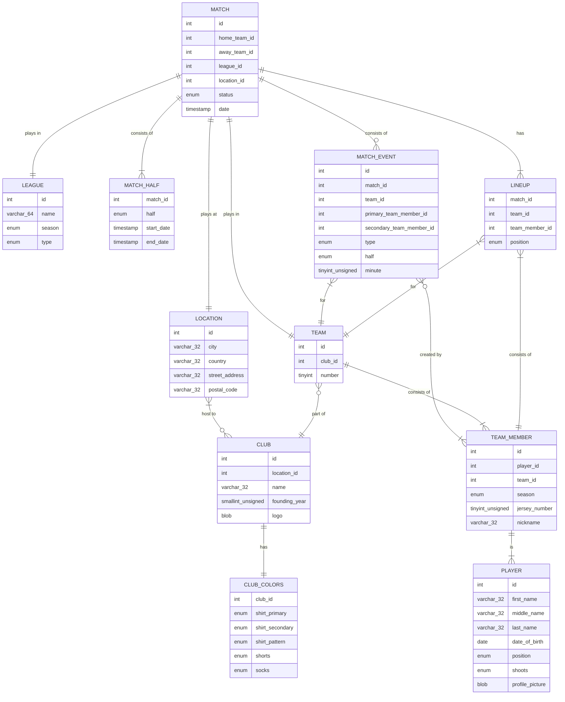

# Design Document

By Abel Spithost

Video overview: https://youtu.be/v1GpHo3lOjM

## Scope

As an amateur football (or "soccer") player, I would like to keep track of my team's games and statistics. To do so, I have built a database in MySQL which would allow me to do just that!

With this database, I should be able to keep track of match scores, lineups for matches, as well as any match events. This includes the clubs and teams that participate in the games, where the games are played, in which league, which players score goals and in what minute, etcetera.

Some out-of-scope features include things such as player ratings, match odds and league standings.

## Functional Requirements

Users should be able to keep track of their team's game performances. Users should be able to schedule games, create lineups for games, add game scores, etcetera. In doing so, users should also be able to track their own and their teammates' statistics, such as goals scored and assists.

Currently, all database users can perform any action. Ideally, in future versions, I would want to add certain rights only to people with a certain role within their football team.

## Representation

### Entities

The most important table in my database is the `matches` table. The main purpose of this database is to keep track of a team's scheduled and played matches, and allow users to add match events and track player statistics from those matches. Six other tables within the database share a relationship with the matches table.

Two of these tables simply add information to matches that you would not always want to retrieve when accessing match data: the `leagues` table includes information about the league and season that the match was played in, and the `locations` table includes information about a games location such as city and street address. The matches table contains two foreign keys that correspond to the primary keys of said tables. The `leagues` table includes an "enum" for the football season, as well as an enum for the type of league (friendly, cup, etc.), as there can only be a handful of options for each column. The `locations` table, on the other hand, includes several VARCHAR's to describe the address.

The matches table also contains two other foreign keys: both from the `teams` table. These reference the primary id of the `teams` column, as a match must always consist of two teams.

Three other tables reference the `matches` table via a foreign key: the `match_halves`, `lineups` and `match_events` table. The `match_halves` table keeps track of the timestamps of each half, so users can keep track of start times, stoppage time, etc. The `lineups` table includes a "position" column that describes the starting position for a player (references via foreign key) and also includes a "team_id" as a foreign key. The `match_events` table keeps track of all match events, such as goals, assists, substitutions, cards, etc.

The `match_events` table allows users to track everything that happens during a match. Based on the entries, users can also derive the scores from a match. It includes several foreign keys, such as the `match_id`, `team_id`, and a foreign key that references the primary player (i.e. goal scorer, player substituted into the game). It includes an optional foreign key for secondary player, for example the player who assists a goal or who is substituted out of a game. The type of match event is an "enum", and can have values such as "goal", "yellow_card", etc. Match events are logged for every half and every minute of said half.

In the `lineups` table, you can create starting lineups for games. You can create entries for every player and select a listed position, which is of type "enum". The table includes foreign keys for the player in question, the team, and the match. The constraint checks that only one player can be part of the lineup for a match.

In club football, a team must always be part of a club. Therefore, the `teams` table references the `clubs` table via foreign key. Other than that, the `teams` table itself only contains an id that serves as the primary key, and a column called "number" of type "tinyint", as most clubs only have a handful of numbered teams (i.e. team #1, team #2, etc.). Obviously, only one team with a certain number can exist per club, which is why the database includes a unique constraint for this combination.

The `clubs` table includes some basic information such as the club name of type "VARCHAR", and a foreign key of "location_id", that references the `locations` table. This is the home location of the club. One other table provides some additional information about a club and shares a one-to-one relationship with it: the `clubs_colors` table. In case a user wants to retrieve some extra information about a club's colors (jersey, shorts, etc.), they can query this table based on the foreign key of "club_id".

The `players` table has a one-to-many relationship to the `team_members` table. For example, I would have one entry as a player, which contains my personal information. I can have several team_member entries: one for every team and every season. The `team_members` table contains foreign keys that reference both a player and a team, and also contains an "enum" for the season that the player has membership of a team. The table includes a constraint so that only one player can be a member of one team every season.

The schema includes a fuction. One, `get_team_id`, returns the primary key "id" from the `teams` table. It takes a club name and a team number as parameters.

### Relationships

Below you can find the entity-relationship diagram for my project. As described in the previous section, `matches` and `matches_events` track all information about matches, and all other tables provide supporting roles to track data about football games.

## Optimizations

The schema includes a view that joins the `clubs` and `teams` table. This allows users to easily show both the club name and the team number associated with a team's id.

Additionally, the project has some custom indexes to allow for more performant queries. The `leagues` table has an index on the "season", as you will often look up a league by a season (which is an enum). Similarly, on the `matches` table, you can query matches on an index based on the status, which is also an enum; you can query for games that still need to be played, that have already been played, etcetera. On the `match_events` table, you can query events based on the type of event (which is an enum), such as goals, red cards, etc.

## Limitations

This database design decouples quite some logic into separate tables. Even for relatively simple queries, you often have to perform multiple joins or query multiple tables. In future versions, I would either add more redundancy, or add more functions or views to allow for easier querying of data. Similarly, this design only allows for teams that are part of a club and play in a season as defined by the database. A group of friends who want to keep track of their pickup scores may not be able to use this database.

Similarly, the time(-keeping) aspect may need some further investigation. For example, if a match contains multiple events in the same minute of the match, there is no way to track the order of those events.
